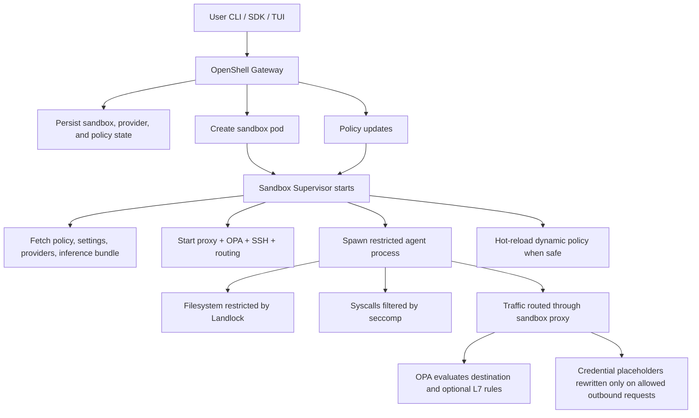

# Project 4 README: OpenShell

## Overview

OpenShell is a security-first runtime for autonomous AI agents. It combines a gateway control plane with per-sandbox local enforcement so that agents run in isolated environments governed by explicit policy. Its main design goal is to protect files, credentials, network egress, and inference routing without relying on agent cooperation.

In practice, OpenShell is more than a sandbox launcher. It is a layered system with:

- a gateway for lifecycle, persistence, authentication, and policy distribution
- a sandbox supervisor for proxying, policy evaluation, SSH mediation, and secret rewriting
- kernel-level controls such as Landlock, seccomp, and network namespaces
- a typed YAML/protobuf policy model that supports safe live updates for dynamic rules

This project folder focuses on reverse engineering how those pieces fit together, why the architecture is layered the way it is, and what tradeoffs OpenShell makes in exchange for stronger security guarantees.

## What This Project Covers

This reverse engineering project is centered on three questions:

- What OpenShell is architecturally
- How its security model actually works in code
- Why its design choices are stronger than simpler single-layer sandbox approaches

The linked report answers those questions by combining repository structure analysis, architecture documentation, source code reading, and security-focused interpretation of the implementation.

## Key Architectural Themes

A few themes show up repeatedly across the repository and are worth keeping in mind before reading the deeper analysis:

- **Control plane vs enforcement plane:** the gateway coordinates, but each sandbox enforces locally
- **Explicit policy over inferred trust:** access is declared, validated, and enforced rather than learned from behavior
- **Compartmentalization:** credentials, runtime state, and failures are intentionally scoped per sandbox
- **Defense in depth:** no single mechanism is expected to carry the whole security model
- **Safe mutability:** only policy domains that can be changed coherently at runtime are hot-reloadable

## Advantages

- Strong defense in depth across filesystem, process, network, inference, and transport layers
- Clear separation between control plane and enforcement plane
- Provider-scoped credential handling with placeholder swapping instead of raw env exposure
- Hot-reload support for network/inference policy without restarting active agents
- Good architecture documentation and test coverage for a relatively young project

## Drawbacks

- Architectural complexity is high compared with simpler container-based agent runners
- Multiple enforcement layers mean higher implementation and debugging overhead
- Some security behavior depends on Linux-specific primitives like Landlock and network namespaces
- Operators need to understand explicit policy authoring rather than relying on permissive defaults
- The system is still early-stage, so rough edges and operational churn are expected

## Why OpenShell Is Interesting to Reverse Engineer

OpenShell is a useful case study because it is not just a generic DevOps repository or a wrapper around Docker. It is trying to solve a hard systems problem: how to let autonomous agents remain useful while still preserving meaningful control over what they can read, where they can connect, which credentials they can use, and how policy can evolve while they are running.

That makes the project interesting from multiple angles:

- as a sandboxing system
- as a control-plane and runtime split architecture
- as a policy-engineering example
- as a real-world defense-in-depth design for agentic software

## How It Works

## Main Components at a Glance

| Component | Primary responsibility | Why it matters |
|---|---|---|
| Gateway | Lifecycle, persistence, auth, policy distribution | Acts as the control-plane boundary |
| Sandbox supervisor | Proxying, OPA evaluation, SSH, secret rewriting | Enforces runtime policy close to the workload |
| Agent process | Executes user-chosen agent/tooling | The workload being constrained |
| Policy layer | YAML/protobuf schema and validation | Keeps authorization explicit and portable |
| Provider layer | Credential discovery and sandbox-scoped injection | Prevents broad secret exposure |
| Test/docs layers | Verification and architecture traceability | Makes the design easier to audit and explain |

## Table of Contents

The main report is [openshell-reverse-engineering-report.md](./openshell-reverse-engineering-report.md).

Question links:

1. [Q1. Why OpenShell uses layered security with multiple enforcement points](./openshell-reverse-engineering-report.md#q1-why-does-openshell-use-layered-security-with-multiple-enforcement-points-rather-than-relying-on-a-single-security-boundary)
2. [Q2. Why OpenShell supports hot-reloading of policies without restarting orchestrated agents](./openshell-reverse-engineering-report.md#q2-what-problem-does-openshell-solve-by-supporting-hot-reloading-of-policies-without-restarting-orchestrated-agents)
3. [Q3. How OpenShell's credential swapping mechanism limits credential access to authorization scope](./openshell-reverse-engineering-report.md#q3-how-does-openshells-credential-swapping-mechanism-prevent-agents-from-accessing-credentials-outside-their-authorization-scope)
4. [Q4. Why OpenShell containerizes policy execution instead of running it in-process with the orchestrator](./openshell-reverse-engineering-report.md#q4-why-does-openshell-containerize-policy-execution-rather-than-running-policies-in-process-with-the-orchestrator)
5. [Q5. What OpenShell gains by separating policy definitions from enforcement mechanisms](./openshell-reverse-engineering-report.md#q5-what-architectural-advantage-does-openshell-gain-by-separating-policy-definitions-from-policy-enforcement-mechanisms)
6. [Q6. Why OpenShell requires explicit authorization declarations instead of inferring permissions from runtime behavior](./openshell-reverse-engineering-report.md#q6-why-does-openshell-require-explicit-agent-authorization-declarations-rather-than-inferring-permissions-from-runtime-behavior)
7. [Q7. How OpenShell prevents policy failures from cascading across agents](./openshell-reverse-engineering-report.md#q7-how-does-openshells-containerized-orchestration-prevent-policy-failures-from-cascading-to-other-agents)
8. [Q8. Why OpenShell compartmentalizes credentials instead of storing them globally](./openshell-reverse-engineering-report.md#q8-what-problem-does-openshell-solve-by-compartmentalizing-credentials-rather-than-storing-them-globally)
9. [Q9. Why policy hot-reloading must preserve coherent handling of in-flight operations](./openshell-reverse-engineering-report.md#q9-why-does-openshells-policy-hot-reloading-require-ensuring-in-flight-operations-complete-before-applying-new-policies)
10. [Q10. How OpenShell's multi-layer approach addresses multiple attacker models better than single-layer enforcement](./openshell-reverse-engineering-report.md#q10-how-does-openshells-multi-layer-security-approach-address-different-attacker-models-better-than-single-layer-enforcement)

## Suggested Reading Order

If someone is new to the project, a sensible order is:

1. Start with the overview and flow diagram in this README.
2. Read Q1, Q2, and Q3 first to understand the core security and credential model.
3. Read Q4, Q5, and Q6 for architectural reasoning.
4. Finish with Q7, Q8, Q9, and Q10 for failure containment and attacker-model analysis.

## Final Takeaway

The central conclusion of this project is that OpenShell should be understood as a policy-distributed agent runtime, not just a sandbox container with extra features. Its architecture is built around explicit trust boundaries, layered enforcement, and careful scoping of secrets and policy state. That makes it more complex than simpler agent runners, but also significantly more interesting and more defensible from a security perspective.
